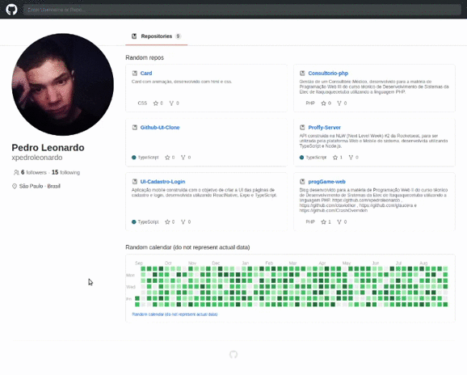

## 🖥️ GitHub | UI Clone

<div align="center">
    
</div>


## 📑 Sobre

Aplicação web, clone da página de perfil do GitHub, desenvolvido seguindo uma vídeo aula da [Rocketseat](https://github.com/Rocketseat).

- Layout Responsivo
- API do GitHub

## ♻ Recursos

- Pesquisa de usuários/repositórios
- Dark Mode


## 👨‍💻 Tecnologias 

O projeto foi desenvolvido utilizando

- React
- TypeScript
- styled-components

## ⬇ Como baixar o projeto

```bash

    #Clonar o Repositório (Via Terminal)
    $ git clone https://github.com/xpedroleonardo/Github-UI-Clone.git

    #Ou

    #Botão verde acima (Zip)
    Baixar projeto compactado

```


## 🚀 Como executar o projeto

Ápós baixar o projeto, execute os seguintes passos: 

```bash

    #Entrar na pasta do projeto
    $ cd Github-UI-Clone/

    #Instalar as depedências (npm ou yarn)
    $ npm | yarn install

    #Executando o Projeto (npm ou yarn)
    $ npm | yarn start

```

Acesse http://localhost:3000/ e explore o projeto.

## ⚠ Atenção !!!

Se você fechar o terminal que o projeto está sendo executado, ele irá parar de funcionar.

Deixe o terminal aberto após rodar os comandos para executar o projeto.

---

### 💻 Feito por [Pedro Leonardo](https://github.com/xpedroleonardo). 

### Gostou do projeto ? De uma estrela ⭐